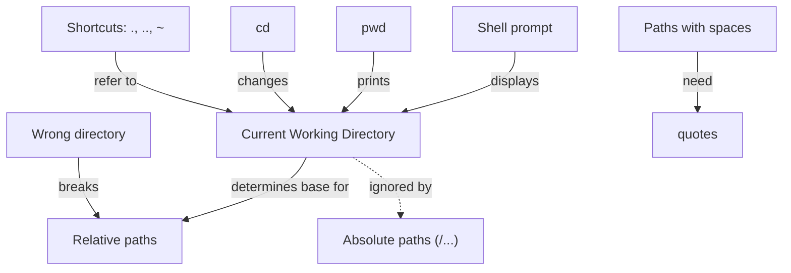

# Workshop Schedule: Introduction to the Command Line

## Duration: 4 hours

**Base Material:** Adapted from [Data Science 101 Workbook - Unix Getting Started](https://datascience.101workbook.org/03-command-line/02e-tutorial-unix-getting-started/#gsc.tab=0)

---

## Schedule (At a glance)

- Start 1:00 PM: Welcome & setup; CLI concepts and getting to the terminal
- Core topics + hands-on: navigation, viewing files, working with files/dirs, permissions, search, redirects/pipes/chaining
- Break: 2:30–2:40 PM
- Wrap-up 4:55–5:00 PM: Recap and Q&A

[See the full, detailed schedule →](docs/schedule.md)

---

## **Assessment of Time Feasibility**

* This material fits into a four hour session while skipping SSH and text editors
* Each section allows starts with explanations followed by demonstrations
* Remaining time will be given to for hands-on exercises

---

## **Concept map — Current Working Directory**

[Download as SVG](../assets/cwd-concept-map.svg)

**Resources for Participants:**

* [Cheat Sheet PDF](https://cheatography.com/davechild/cheat-sheets/linux-command-line/pdf/)
* [ExplainShell](https://explainshell.com/) — Type commands and see breakdown