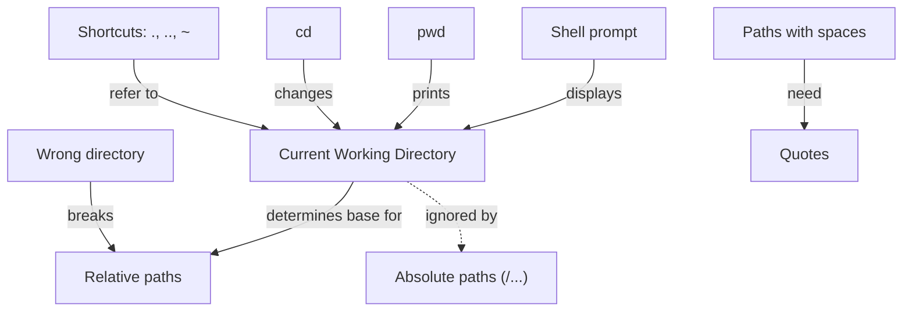

# Introduction to the Command Line Workshop

**Duration:** 4 hours

**Base material:** Adapted from [Data Science 101 Workbook — Unix Getting Started](https://datascience.101workbook.org/03-command-line/02e-tutorial-unix-getting-started/#gsc.tab=0)

---

## Instructors

- Viswanathan Satheesh
- Rick Masonbrink
- Sharu Paul Sharma

## Contact

For questions or suggestions, email [gifhelp@iastate.edu](mailto:gifhelp@iastate.edu).

## Workshop materials

- [Workshop recording and materials](https://research.it.iastate.edu/news/2025/isu-workshop-1-introduction-command-line-material-available)
- [Hands-on exercises](day1/README.md)

## Schedule at a glance

- **1:00 PM:** Welcome and setup; CLI concepts and terminal access
- **Core topics and hands-on practice:** navigation, viewing files, working with files and directories, permissions, search, redirection, pipes, and command chaining
- **2:30–2:40 PM:** Break
- **4:55–5:00 PM:** Recap and Q&A

[See the detailed schedule](docs/schedule.md).

---

## Time feasibility assessment

- This material fits into a four-hour session when SSH and text editors are omitted.
- Each section starts with an explanation, followed by a demonstration.
- Remaining time is reserved for hands-on exercises.

---

## Concept map — Current Working Directory

```mermaid
graph TD
  CWD["Current Working Directory"]
  RelPaths["Relative paths"]
  AbsPaths["Absolute paths (/...)"]
  Prompt["Shell prompt"]
  PWD["pwd"]
  CD["cd <path>"]
  Shortcuts["Shortcuts: ., .., ~"]
  WrongDir["Wrong directory"]
  Spaces["Paths with spaces"]
  Quotes["Quotes"]

  CWD -->|determines base for| RelPaths
  CWD -. ignored by .-> AbsPaths
  Prompt -->|displays| CWD
  PWD -->|prints| CWD
  CD -->|changes| CWD
  Shortcuts -->|refer to| CWD
  WrongDir -->|breaks| RelPaths
  Spaces -->|need| Quotes
```

[Download the concept map as an SVG](docs/assets/cwd-concept-map.svg).

## Resources for participants

- [Linux Command Line Cheat Sheet (PDF)](https://cheatography.com/davechild/cheat-sheets/linux-command-line/pdf/)
- [ExplainShell](https://explainshell.com/) — Enter a command to see an explanation of each argument.
