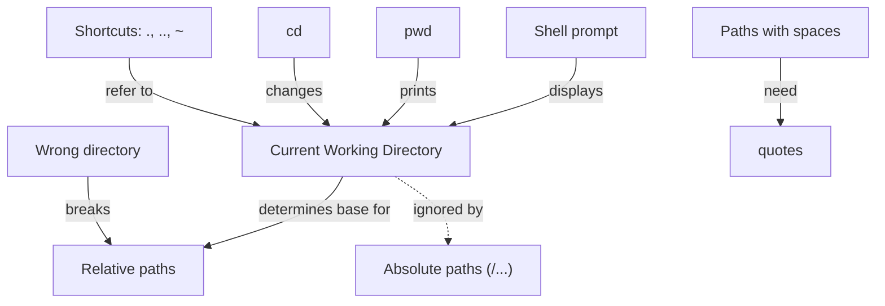

# Day 1 — Teaching Guide (Instructor Notes)

- Audience: absolute/early beginners to CLI
- Duration: 4 hours (with one 10-minute break)

## Objectives
- Understand CLI concepts: terminal vs. shell vs. command line
- Navigate, view, and manipulate files/directories
- Read permissions; change with chmod
- Search with find/grep
- Combine commands with redirects/pipes/chaining
- Use environment variables safely

---

## 1:00–1:15 — Welcome & Setup

Talking points:
- Why CLI matters (automation, reproducibility, remote work)
- Distinguish terminal (app), shell (program), command line (interface)
- Which shell are we using today; ensure consistent behavior

Live demo:
```bash
# What shell and version?
echo $SHELL
$SHELL --version || true

# Where am I? What's this machine?
pwd
uname -a
```

Common pitfalls:
- Different shells: bash vs zsh (minor differences today)
- Windows users: WSL or Git Bash

---

## 1:15–1:30 — Open OnDemand + VSCode (optional if local)

Talking points:
- Briefly show login flow, interactive sessions, and launching VSCode
- Emphasize terminal panel inside VSCode for exercises

If demonstrating live:
- Show opening a terminal in VSCode, confirm repo root with `pwd`

---

## 1:30–2:00 — Navigating the File System

Talking points:
- Paths: absolute vs relative; `.` and `..`
- Listing details and hidden files

Live demo:
```bash
pwd
ls
ls -la
cd day1
pwd
cd data
pwd
# Go back to the last directory
cd -

# Find directories recursively
echo "Directories under day1/data:"
find day1/data -type d | head
```

Hands-on: `day1/exercises/01_navigation.md`

Instructor tips:
- Encourage tab completion, history search (Ctrl-R)
- Reinforce mental model of current working directory

Concept map — Current Working Directory




[Download as SVG](../assets/cwd-concept-map.svg)

---

## 2:00–2:30 — Viewing Files and Directories

Talking points:
- When to use `cat` vs `less`
- `head`/`tail` for quick peeks; wildcards for batches

Live demo:
```bash
# Peek at samples
head -n 2 day1/data/raw/sample1.txt
tail -n 3 day1/data/raw/sample2.txt

# Page through and search within less (press /GET then n)
less +/GET day1/data/projects/alpha/logs/access.log

# Combine streams and count the lines
cat day1/data/raw/*.txt | wc -l
```

Hands-on: `day1/exercises/02_viewing.md`

Pitfalls:
- Wildcards expand in the shell; quote paths with spaces

---

## 2:30–2:40 — Break

Invite questions; keep terminal visible with summary commands on screen.

---

## 2:40–3:10 — Working with Files and Directories

Talking points:
- `mkdir -p` for nested dirs
- Copy vs move; recursive operations
- Safe removal; avoid `rm -rf` blind usage

Live demo:
```bash
mkdir -p day1/pork/step2 day1/results
cp day1/data/raw/*.txt day1/pork/step2/
ls -l day1/pork/step2
mv day1/data/tmp/test.txt day1/work/
# Remove empty files safely
find day1/data/tmp -type f -empty -delete
# Recursive copy example
cp -r day1/data/projects/alpha day1/work/alpha_copy
```

Hands-on: `day1/exercises/03_files_dirs.md`

---

## 3:10–3:40 — Permissions and Ownership

Talking points:
- Interpreting `ls -l` (rwx for user/group/other)
- Changing modes with `chmod`; brief on execute bit for scripts

Live demo:
```bash
ls -l day1/work/step1
# Make a file read-only for user
chmod u-w day1/work/step1/sample1.txt
ls -l day1/work/step1/sample1.txt
# Make a script executable
chmod +x day1/scripts/reset_workspace.sh
# Remove exec from a non-script file
chmod -x day1/work/alpha_copy/logs/access.log || true
```

Hands-on: `day1/exercises/04_permissions.md`

---

## 3:40–4:10 — Finding Files and Grep

Talking points:
- `find` for filesystem queries; `grep` for content
- Useful flags: `-name`, `-type`, `-mtime`; `-i`, `-n`, `-E`

Live demo:
```bash
# Find log files
find day1/data -type f -name '*.log'
# Modified in the last 7 days
find day1/data -type f -mtime -7
# Search content
grep -ni 'error' day1/data/projects/beta/logs/error.log
# Status 500 lines with line numbers
grep -n ' 500 ' day1/data/projects/alpha/logs/access.log
# Regex example
grep -E 'user=\w+' day1/data/projects/alpha/logs/access.log
```

Hands-on: `day1/exercises/05_find_grep.md`

---

## 4:10–4:40 — Redirects, Pipes, and Chaining

Talking points:
- `>` overwrite vs `>>` append; `|` pipeline; `;`, `&&`, `||` flow control

Live demo:
```bash
# Uppercase all txt into a single file
cat day1/data/raw/*.txt | tr '[:lower:]' '[:upper:]' > day1/results/all_upper.txt
# Count GET lines
grep 'GET' day1/data/projects/alpha/logs/access.log | wc -l > day1/results/get_count.txt
# Unique names from CSV (skip header)
tail -n +2 day1/data/reports/summary.csv | cut -d, -f1 | sort -u > day1/results/names.txt
# Chaining
mkdir -p day1/work/step2 && echo OK
cat nofile.txt || echo failed
```

Hands-on: `day1/exercises/06_redirects_pipes.md`

---

## 4:40–4:55 — Environment and Variables

Talking points:
- Reading env vars; setting and exporting
- Modifying PATH temporarily and safely

Live demo:
```bash
echo "$HOME"
echo "$PATH"
export PATH="$PATH:$(pwd)/day1/scripts"
which EchoScript.sh || true

DATA_DIR=$(pwd)/day1/data
ls "$DATA_DIR"/*.csv || true
export DATA_DIR
bash -c 'echo $DATA_DIR'
```

Hands-on: `day1/exercises/07_env_vars.md`

---

## 4:55–5:00 — Recap & Q&A

- Review the command categories and where they were applied
- Encourage continued practice and share resources in `README.md`

---

## Appendix — Troubleshooting & Tips
- Use quotes around paths with spaces
- Use `man <cmd>` or `<cmd> --help` for flags
- `history | tail -n 20` to recall recent commands
- Keyboard shortcuts: Ctrl-C (cancel), Ctrl-R (history search), Tab (complete)
